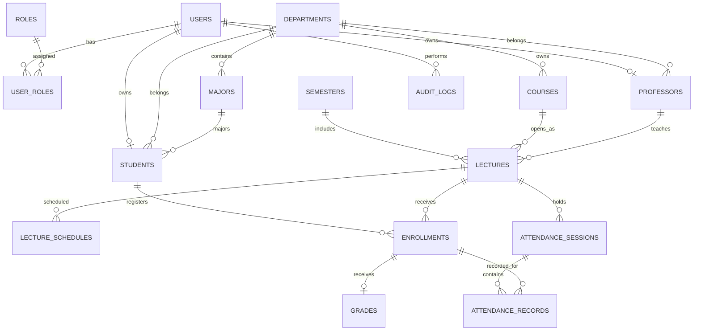

# 학사관리 시스템 1차 MVP ERD 초안

## 1. 설계 원칙

- 사용자 계정과 학생·교수 업무 정보를 분리한다.
- 과목(`courses`)은 교육과정의 기본 단위이며, 강좌(`lectures`)는 특정 학기에 실제 개설된 분반이다.
- 수강 신청(`enrollments`)을 기준으로 출결과 성적을 연결한다.
- 주요 상태 변경과 관리자 조정은 감사 이력(`audit_logs`)에 기록한다.
- 2차 역할 확장을 위해 사용자와 역할을 다대다 구조로 설계한다.

## 2. ERD

## 3. 테이블 정의 초안

### 3.1 인증 및 사용자

#### `users`

| 컬럼 | 타입 | 제약 | 설명 |
|---|---|---|---|
| id | BIGINT | PK | 사용자 ID |
| login_id | VARCHAR(50) | UNIQUE, NOT NULL | 로그인 ID |
| password_hash | VARCHAR(255) | NOT NULL | 암호화 비밀번호 |
| name | VARCHAR(50) | NOT NULL | 이름 |
| email | VARCHAR(100) | UNIQUE | 이메일 |
| status | VARCHAR(20) | NOT NULL | ACTIVE, INACTIVE |
| created_at | DATETIME | NOT NULL | 생성 시각 |
| updated_at | DATETIME | NOT NULL | 수정 시각 |

#### `roles`

| 컬럼 | 타입 | 제약 | 설명 |
|---|---|---|---|
| id | BIGINT | PK | 역할 ID |
| code | VARCHAR(30) | UNIQUE, NOT NULL | STUDENT, PROFESSOR, ADMIN |
| name | VARCHAR(50) | NOT NULL | 역할명 |

#### `user_roles`

| 컬럼 | 타입 | 제약 | 설명 |
|---|---|---|---|
| user_id | BIGINT | PK, FK | 사용자 ID |
| role_id | BIGINT | PK, FK | 역할 ID |

### 3.2 조직 및 학적

#### `departments`

| 컬럼 | 타입 | 제약 | 설명 |
|---|---|---|---|
| id | BIGINT | PK | 학과 ID |
| code | VARCHAR(20) | UNIQUE, NOT NULL | 학과 코드 |
| name | VARCHAR(100) | NOT NULL | 학과명 |
| active | BOOLEAN | NOT NULL | 사용 여부 |

#### `majors`

| 컬럼 | 타입 | 제약 | 설명 |
|---|---|---|---|
| id | BIGINT | PK | 전공 ID |
| department_id | BIGINT | FK, NOT NULL | 소속 학과 |
| code | VARCHAR(20) | UNIQUE, NOT NULL | 전공 코드 |
| name | VARCHAR(100) | NOT NULL | 전공명 |
| active | BOOLEAN | NOT NULL | 사용 여부 |

#### `students`

| 컬럼 | 타입 | 제약 | 설명 |
|---|---|---|---|
| id | BIGINT | PK | 학생 ID |
| user_id | BIGINT | UNIQUE, FK, NOT NULL | 사용자 ID |
| student_no | VARCHAR(20) | UNIQUE, NOT NULL | 학번 |
| department_id | BIGINT | FK, NOT NULL | 소속 학과 |
| major_id | BIGINT | FK, NULL | 전공 |
| grade_level | TINYINT | NOT NULL | 학년 |
| admission_year | SMALLINT | NOT NULL | 입학년도 |
| academic_status | VARCHAR(20) | NOT NULL | ENROLLED 등 |

#### `professors`

| 컬럼 | 타입 | 제약 | 설명 |
|---|---|---|---|
| id | BIGINT | PK | 교수 ID |
| user_id | BIGINT | UNIQUE, FK, NOT NULL | 사용자 ID |
| professor_no | VARCHAR(20) | UNIQUE, NOT NULL | 교번 |
| department_id | BIGINT | FK, NOT NULL | 소속 학과 |

### 3.3 학기, 과목 및 강좌

#### `semesters`

| 컬럼 | 타입 | 제약 | 설명 |
|---|---|---|---|
| id | BIGINT | PK | 학기 ID |
| academic_year | SMALLINT | NOT NULL | 학년도 |
| term | VARCHAR(20) | NOT NULL | FIRST, SECOND |
| start_date | DATE | NOT NULL | 학기 시작일 |
| end_date | DATE | NOT NULL | 학기 종료일 |
| enrollment_start_at | DATETIME | NOT NULL | 수강 신청 시작 |
| enrollment_end_at | DATETIME | NOT NULL | 수강 신청 종료 |
| cancellation_end_at | DATETIME | NOT NULL | 수강 취소 종료 |
| max_credits | TINYINT | NOT NULL | 최대 신청 학점 |
| is_current | BOOLEAN | NOT NULL | 현재 학기 여부 |

고유 제약: `(academic_year, term)`

#### `courses`

| 컬럼 | 타입 | 제약 | 설명 |
|---|---|---|---|
| id | BIGINT | PK | 과목 ID |
| department_id | BIGINT | FK, NOT NULL | 주관 학과 |
| code | VARCHAR(20) | UNIQUE, NOT NULL | 과목 코드 |
| name | VARCHAR(100) | NOT NULL | 과목명 |
| credits | TINYINT | NOT NULL | 학점 |
| completion_type | VARCHAR(30) | NOT NULL | 전공필수, 전공선택, 교양 등 |
| active | BOOLEAN | NOT NULL | 사용 여부 |

#### `lectures`

| 컬럼 | 타입 | 제약 | 설명 |
|---|---|---|---|
| id | BIGINT | PK | 강좌 ID |
| semester_id | BIGINT | FK, NOT NULL | 개설 학기 |
| course_id | BIGINT | FK, NOT NULL | 과목 |
| professor_id | BIGINT | FK, NOT NULL | 담당 교수 |
| section_no | VARCHAR(10) | NOT NULL | 분반 |
| capacity | INT | NOT NULL | 정원 |
| enrolled_count | INT | NOT NULL, DEFAULT 0 | 현재 신청 인원 |
| classroom | VARCHAR(50) | NULL | 강의실 |
| status | VARCHAR(20) | NOT NULL | OPEN, CLOSED |
| grade_status | VARCHAR(20) | NOT NULL | DRAFT, SUBMITTED, CONFIRMED |

고유 제약: `(semester_id, course_id, section_no)`

#### `lecture_schedules`

| 컬럼 | 타입 | 제약 | 설명 |
|---|---|---|---|
| id | BIGINT | PK | 시간표 ID |
| lecture_id | BIGINT | FK, NOT NULL | 강좌 ID |
| day_of_week | VARCHAR(10) | NOT NULL | MON~SUN |
| start_period | TINYINT | NOT NULL | 시작 교시 |
| end_period | TINYINT | NOT NULL | 종료 교시 |

### 3.4 수강, 출결 및 성적

#### `enrollments`

| 컬럼 | 타입 | 제약 | 설명 |
|---|---|---|---|
| id | BIGINT | PK | 수강 신청 ID |
| student_id | BIGINT | FK, NOT NULL | 학생 ID |
| lecture_id | BIGINT | FK, NOT NULL | 강좌 ID |
| status | VARCHAR(20) | NOT NULL | ACTIVE, CANCELED |
| enrolled_at | DATETIME | NOT NULL | 신청 시각 |
| canceled_at | DATETIME | NULL | 취소 시각 |
| adjusted_by_admin | BOOLEAN | NOT NULL | 관리자 조정 여부 |

고유 제약: `(student_id, lecture_id)`

#### `attendance_sessions`

| 컬럼 | 타입 | 제약 | 설명 |
|---|---|---|---|
| id | BIGINT | PK | 수업일 ID |
| lecture_id | BIGINT | FK, NOT NULL | 강좌 ID |
| session_date | DATE | NOT NULL | 수업일 |
| session_no | INT | NOT NULL | 차시 |

고유 제약: `(lecture_id, session_date, session_no)`

#### `attendance_records`

| 컬럼 | 타입 | 제약 | 설명 |
|---|---|---|---|
| id | BIGINT | PK | 출결 기록 ID |
| attendance_session_id | BIGINT | FK, NOT NULL | 수업일 ID |
| enrollment_id | BIGINT | FK, NOT NULL | 수강 신청 ID |
| status | VARCHAR(20) | NOT NULL | PRESENT, LATE, ABSENT, EXCUSED |
| updated_at | DATETIME | NOT NULL | 수정 시각 |

고유 제약: `(attendance_session_id, enrollment_id)`

#### `grades`

| 컬럼 | 타입 | 제약 | 설명 |
|---|---|---|---|
| id | BIGINT | PK | 성적 ID |
| enrollment_id | BIGINT | UNIQUE, FK, NOT NULL | 수강 신청 ID |
| score | DECIMAL(5,2) | NULL | 최종 점수 |
| letter_grade | VARCHAR(5) | NULL | A+~F |
| updated_at | DATETIME | NOT NULL | 수정 시각 |

### 3.5 감사

#### `audit_logs`

| 컬럼 | 타입 | 제약 | 설명 |
|---|---|---|---|
| id | BIGINT | PK | 이력 ID |
| actor_user_id | BIGINT | FK, NOT NULL | 수행 사용자 |
| action | VARCHAR(50) | NOT NULL | 작업 유형 |
| target_type | VARCHAR(50) | NOT NULL | 대상 유형 |
| target_id | BIGINT | NOT NULL | 대상 ID |
| before_value | JSON | NULL | 변경 전 요약 |
| after_value | JSON | NULL | 변경 후 요약 |
| reason | VARCHAR(500) | NULL | 변경 사유 |
| created_at | DATETIME | NOT NULL | 수행 시각 |

## 4. 주요 인덱스 제안

| 테이블 | 인덱스 |
|---|---|
| `lectures` | `(semester_id, status)`, `(professor_id, semester_id)` |
| `enrollments` | `(student_id, status)`, `(lecture_id, status)` |
| `attendance_records` | `(enrollment_id)` |
| `audit_logs` | `(created_at)`, `(actor_user_id, created_at)`, `(action, created_at)` |

## 5. 구현 시 결정할 사항

- `lectures.enrolled_count`를 저장할 경우 수강 신청·취소 트랜잭션에서 반드시 동기화한다.
- 총 취득학점은 별도 컬럼으로 저장하지 않고 확정 성적을 기준으로 집계하는 것을 1차 기본안으로 한다.
- 평점 계산 기준은 발표 전에 등급별 평점표를 확정한다.
- 1차에서 전공 구분이 필요하지 않다면 `majors`와 `students.major_id` 구현은 후순위로 둔다.
